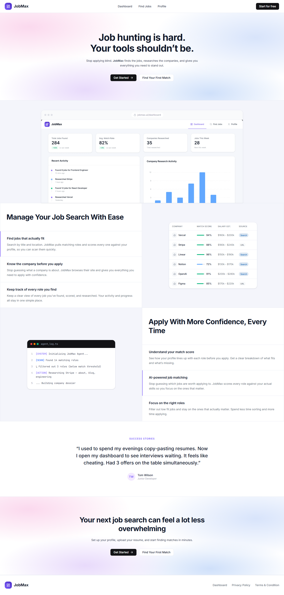
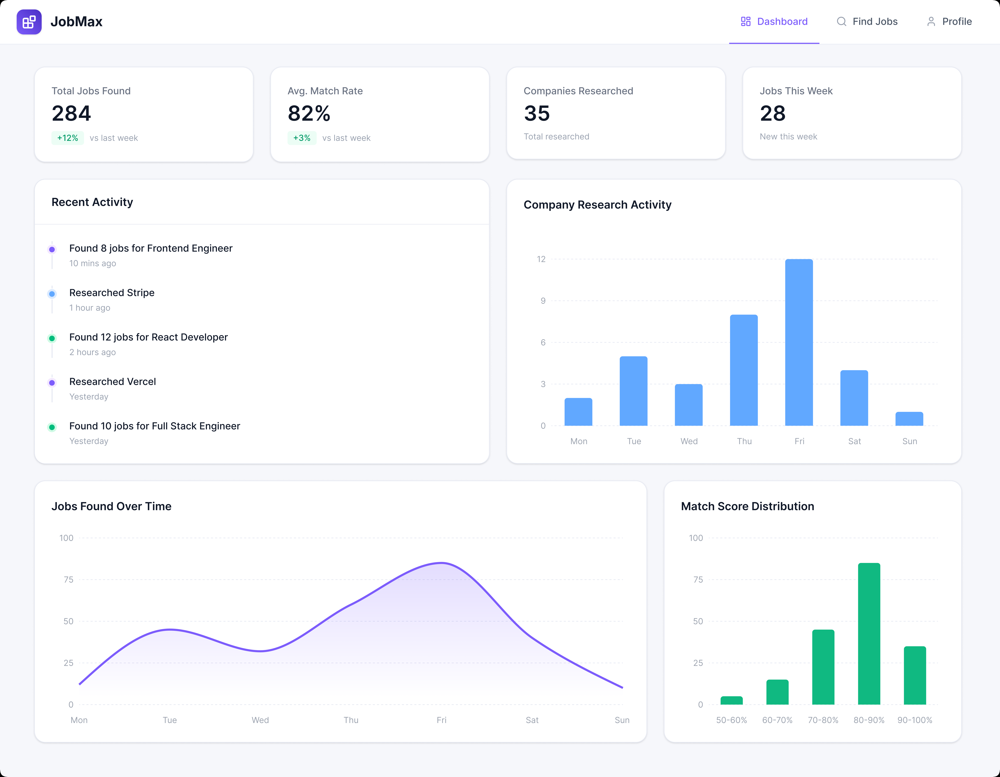
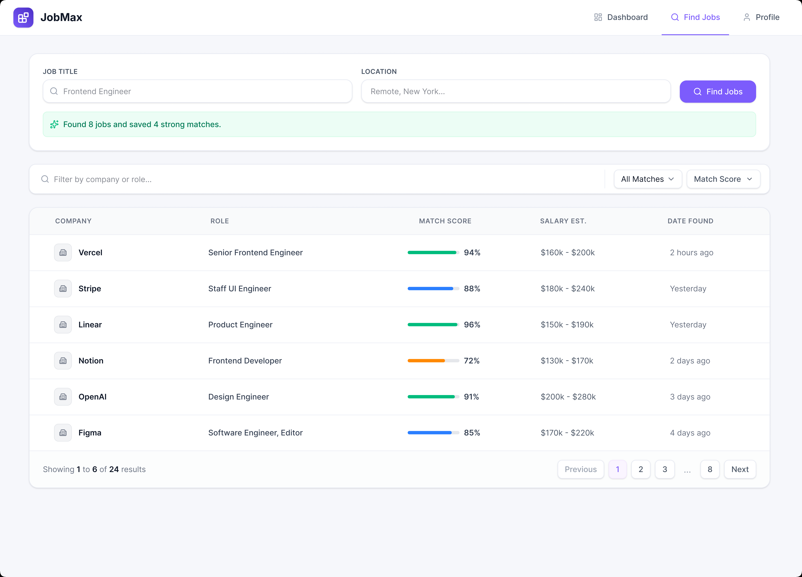
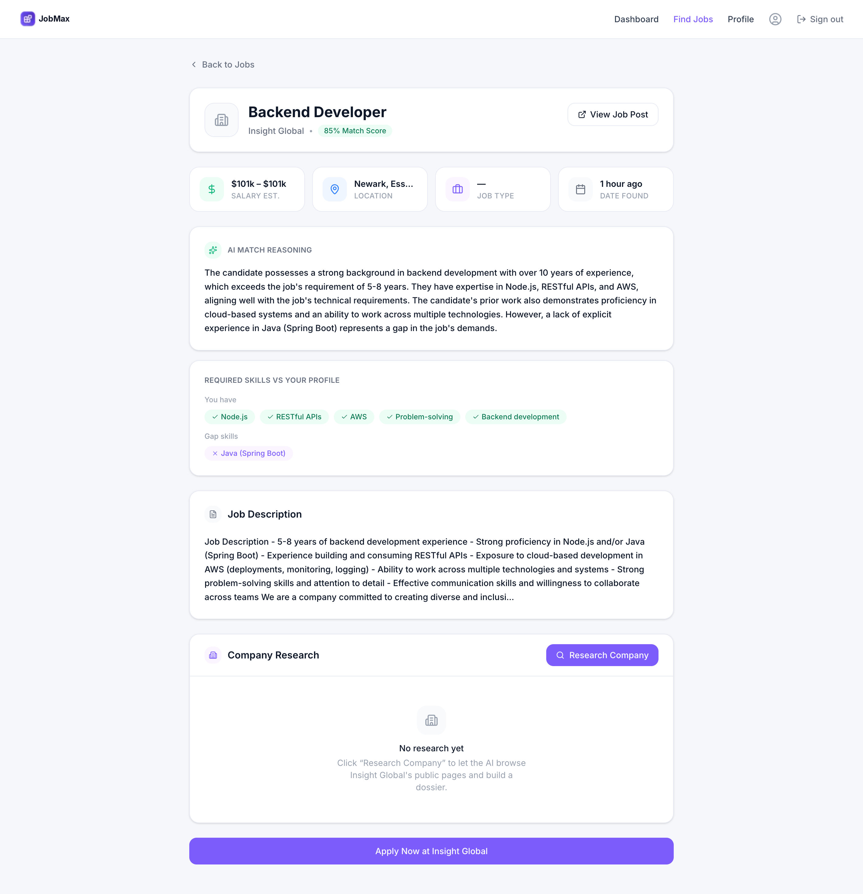
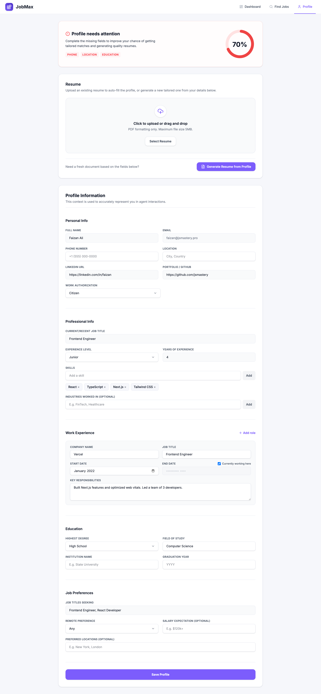

# JobMax

**An AI job-hunting assistant.** Set up your profile once, and the agent discovers relevant roles from Adzuna, scores each one against your actual skills with GPT-4o, and researches the company across their public pages so you arrive at every application already informed.

> ### ⚠️ Active development — Phase 1 of 5
>
> Foundation is complete: homepage, OAuth, analytics, and the database schema all work. **The job discovery, matching, and company research features are not built yet.** See [Status](#status) for exactly what runs today.



<sub>A real capture of the running app. Marketing copy — including the testimonial — is placeholder pending real content.</sub>

---

## The problem

Job hunting is repetitive in a way that has nothing to do with whether you're a good fit. You read dozens of descriptions, decide if each one matches, then research every company from scratch — all before you click apply.

JobMax does the preparation. It finds the jobs, scores them against your real skills, and builds a company dossier for each one. You decide which to apply to.

**Intended flow:** sign in → fill your profile and upload a resume → search by title and location → the agent scores every result → open a job to see the match breakdown and research the company → apply through the employer's own link.

Auto-apply is explicitly out of scope. JobMax never fills or submits an application form; it links to the employer's apply URL and stops there.

---

## Status

Built against a 17-feature plan across 5 phases ([`context/build-plan.md`](context/build-plan.md)). Status is tracked in [`context/progress-tracker.md`](context/progress-tracker.md), which is the source of truth.

| Phase | Feature | State |
| --- | --- | --- |
| **1 — Foundation** | 01 Homepage | ✅ Done |
| | 02 Auth — Google + GitHub OAuth | ⚠️ Partial <sup>1</sup> |
| | 03 PostHog initialisation | ✅ Done |
| | 04 Database schema | ✅ Done |
| **2 — Profile** | 05–08 Profile UI, save, resume parsing, PDF generation | 📋 Planned |
| **3 — Find Jobs** | 09–11 Search UI, Adzuna discovery, filter/sort/pagination | 📋 Planned |
| **4 — Job Details** | 12–13 Details page, company research agent | 📋 Planned |
| **5 — Dashboard** | 14–17 Dashboard UI, stats, activity, analytics charts | 📋 Planned |

<sup>1</sup> Google sign-in is verified end to end. GitHub is implemented and returns a valid authorize redirect, but has never been clicked through past the consent screen. Sign-out has a working route and button, also unverified.

**What this means in practice:** `/` and `/login` work. `/profile` is a placeholder showing your signed-in email. `/dashboard` and `/find-jobs` don't exist yet — signed out they redirect to `/login` like any protected route, and signed in they 404.

---

## Target design

The pages below are **design references, not working screens.** They are what Phases 2–5 are being built toward.

| | |
| --- | --- |
| **Dashboard** (Feature 14) | **Find Jobs** (Feature 09) |
|  |  |
| **Job Details** (Feature 12) | **Profile** (Feature 05) |
|  |  |

---

## Stack

Installed and in use:

| Layer | Tool | Notes |
| --- | --- | --- |
| Framework | Next.js 16.2.12 (App Router) | Middleware is **Proxy** in 16 — the file is `proxy.ts` |
| UI | React 19.2.4 | |
| Styling | Tailwind CSS **v4** | Tokens live in `@theme` in `app/globals.css`; there is no `tailwind.config.ts` |
| Components | shadcn/ui + Radix | |
| Icons | lucide-react v1 | v1 dropped brand marks, so the Google/GitHub logos are inline SVGs |
| Backend | InsForge (`@insforge/sdk`) | Postgres, auth, storage |
| Analytics | PostHog (`posthog-js`, `posthog-node`) | |
| Language | TypeScript, strict | |

Planned but **not yet installed** — these arrive with the features that need them: Adzuna API (job discovery), OpenAI GPT-4o (matching, extraction, synthesis), Browserbase + Stagehand (company research), `@react-pdf/renderer` and `pdf-parse` (resume generation and parsing), `zod`.

---

## Getting started

### Prerequisites

- **Node.js ≥ 20.9** (required by Next 16)
- An **InsForge** project — provides the database, auth, and storage
- A **PostHog** project — free tier is fine

### 1. Install

```bash
npm install
```

### 2. Configure environment

```bash
cp .env.example .env.local
```

Fill in the four variables needed to run today:

| Variable | Where to find it |
| --- | --- |
| `NEXT_PUBLIC_INSFORGE_URL` | InsForge dashboard → Install → API Keys |
| `NEXT_PUBLIC_INSFORGE_ANON_KEY` | Same page |
| `NEXT_PUBLIC_POSTHOG_KEY` | PostHog → Project settings → Project API Key |
| `NEXT_PUBLIC_POSTHOG_HOST` | `https://us.i.posthog.com` (or your region) |

The remaining keys in `.env.example` are for unbuilt features and can stay empty.

### 3. Apply the database schema

[`db/schema.sql`](db/schema.sql) is the source of truth — four tables, row-level security, indexes, and constraints. Every statement is idempotent, so re-running is safe.

Apply it with the InsForge MCP `run-raw-sql` tool, or paste it into the InsForge dashboard SQL editor. Then create a **private** storage bucket named `resumes`.

### 4. Configure OAuth

Enable Google and GitHub in the InsForge dashboard, and add `http://localhost:3000/api/auth/callback` to **allowed redirect URLs**.

### 5. Run

```bash
npm run dev
```

> **The dev server must be on port 3000.** The OAuth redirect registered with InsForge is `http://localhost:3000/api/auth/callback`. If something else holds 3000, Next silently falls back to 3001 and sign-in then fails at the callback with an error that looks nothing like the real cause.

| Script | Does |
| --- | --- |
| `npm run dev` | Dev server |
| `npm run build` | Production build |
| `npm start` | Serve the production build |
| `npm run lint` | ESLint |

---

## Security model

**Row-level security is the only access control on the database — not defence in depth.**

InsForge sets a default ACL on the `public` schema granting full `INSERT/SELECT/UPDATE/DELETE` to both `anon` and `authenticated` on every table created there, and both roles already hold schema `USAGE`. A table added without RLS is therefore world-readable *and* world-writable by unauthenticated callers.

Every table in `db/schema.sql` accordingly has RLS enabled, one `FOR ALL TO authenticated` policy comparing `auth.uid()`, and an explicit `REVOKE` of `anon`. **Never add a table without doing all three.** Queries must still scope to `user_id` in application code — RLS is the backstop, not a licence to drop the filter.

---

## Project structure

```
app/                  Pages and API routes only — no business logic
  (auth)/login/       Login page
  api/auth/           OAuth start, callback, logout
  profile/            Placeholder until Feature 05
components/
  ui/                 shadcn/ui primitives
  layout/             Navbar, Footer, Logo
  homepage/           Hero, Features, Testimonial, previews
  auth/               OAuth buttons, logout, login showcase
  analytics/          Effect-only, render null — no markup
context/              Spec files (see below)
db/schema.sql         Full DDL + RLS — source of truth
lib/                  Third-party clients and shared utilities
types/                Row types, mirrored from db/schema.sql
proxy.ts              Session check on protected routes (Next 16 Proxy)
instrumentation-client.ts   PostHog browser init
```

Folders named in [`context/architecture.md`](context/architecture.md) but not yet created — `agent/`, `actions/` — arrive with the features that need them.

---

## How this project is built

JobMax is **spec-driven and AI-assisted.** The specification lives in `context/` and is read in a fixed order before any code is written:

```
project-overview → architecture → ui-tokens → ui-rules → ui-registry
→ code-standards → library-docs → build-plan → progress-tracker
```

Those files define the design tokens, the architectural boundaries, and a set of invariants that are never violated — API routes hold no UI logic, components hold no DB logic, agent code never imports from `components/`, and no component uses a hardcoded hex value or a raw Tailwind colour class.

Custom workflow skills live in `.claude/skills/`: `/architect` before a complex feature, `/review` after one, `/imprint` to capture UI patterns, `/recover` when something breaks, and `/remember` to carry state across sessions.

Start with [`AGENTS.md`](AGENTS.md) before changing anything.

---

## Licence

No licence has been specified. All rights reserved.
